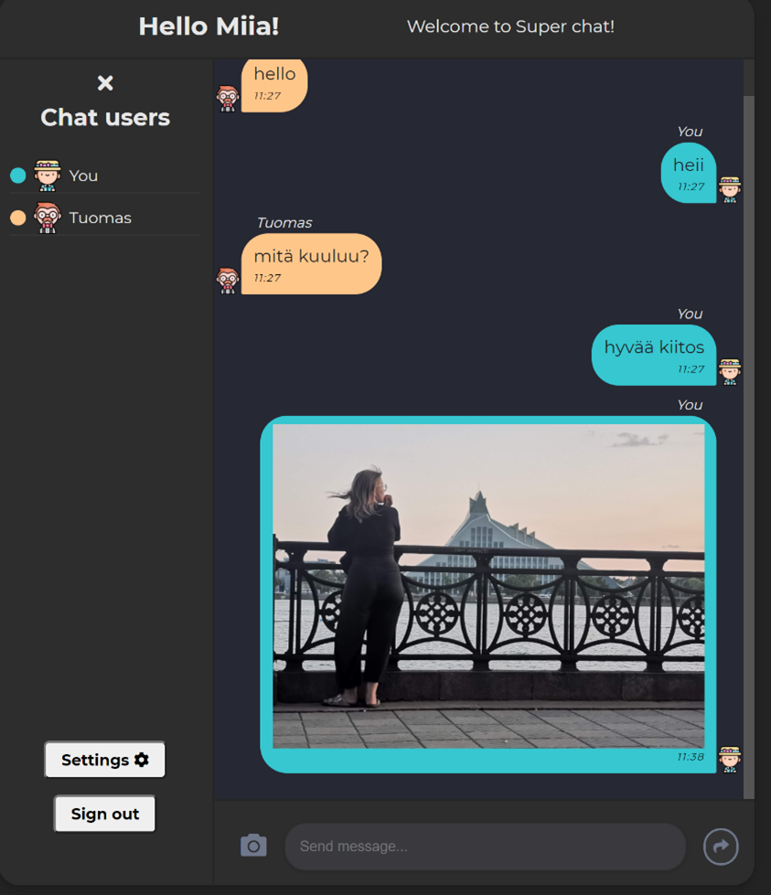

# Super chat app

This project's goal was to practice using Googles BAAS Firebase. I created a chat app that uses Firebase Firestorr
database, Firebase authentication and firebase realtime database. This was my first touch using and building the backend
to my projects.

### [LIVE VERSION]('https://miianyy.github.io/superchat/')




## General

Users sign in to the chat using Google authentication. They can choose their own username, color and icon which are used
as indicators for other users in the chat.

In the app there is one chat room where users can send text and image messages to each other. Users can see other users
that are currently using app in the sidebars list.

I created this element by updating the user document in the database every 20 seconds when user is using the app. Other
function listens any updates in user database and shows user in the online list if their last appearance has been in the
last three minutes.

## Firebase

Chat messages sent by users are stored in a "_Super Chat_" database collection called "_messages_" as documents.
Documents store information such as who sent the message, when it was sent, and what is in the message. When user sends
new message to the chat, this information is sent to the database.

````javascript
// Example message
await db.collection('messages').add({
    senderName: "miianyy",
    senderIcon: "blonde-hair",
    text: "Hello, how are you",
    createdAt: firebase.firestore.FieldValue.serverTimestamp(),
    uid,
    color: "blue",
})
````

When chat room is first loaded and after every time new message is added chat messages are updated and new messages show
to users.

````javascript
// Stores all of the messages from database
const [messages, setMessages] = useState([]);

useEffect(() => {
    // Gets all messages documents from database
    db.collection('messages').orderBy('createdAt').limit(50)
      .onSnapshot((snapshot) => {
          setMessages(snapshot.docs.map(doc => doc.data()));
      })
}, [])

return (
    <section>
        { messages.map((msg, index) => {
            return <ChatMessage key={ uniqid() } message={ msg }/>
        }) }
    </section>
)
````

User can also send image messages to each other. These images are stored in the Firebase Storage to their own folders
and files. In the "_messages_" collection, is a document containing the url location of the image in the 
Firebase Storage. Using this url the image can be displayed to the user.

## Things I learned

- How navigate in the Firebase Console
- How to create new database to Firestore and how to create new documents in it using Firebase Console and in my code
- How to fetch the data from database document and how to update or delete it
    - If user wants to change or update their user settings, how can I update all the messages documents from that
      current user so in the message shows right user settings
- How other users that are using chat, can see who others are currently using the chat

## Technologies

- React
    - React hooks
        - useState
        - useEffect
        - useRef
    - Styled Components 💅
    - create-react-app
- JavaScript
    - es6
    - async await
    - try/catch
- CSS
    - mobile first

